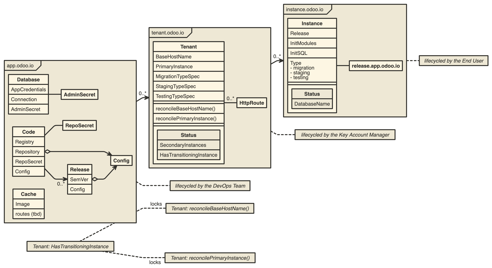

# The Odoo Operator
The Odoo Operator is reified (in the form of code) odoo operating knowledge. It's goal is to handle all known transitions of the lifecycle of a Odoo deployment challange. Therefore, it should work for both, a single client project and a SaaS offering.

- Please start by going through the [Kubebuilder Book](https://book.kubebuilder.io) tutorial
- Next, make sense out of the [UML](http://www.nomnoml.com/#view/%23direction%3A%20right%0A%5B%3Cframe%3Eapp.odoo.io%7C%0A%20%20%5BDatabase%7C%0A%20%20%09AppCredentials%20%7C%0A%20%20%09Connection%20%7C%0A%20%20%09AdminSecret%0A%20%20%5D%0A%20%20%5BDatabase%5D%20-%20%5BAdminSecret%5D%0A%20%20%5BConfig%5D%0A%20%20%5BCode%20%7C%20%0A%20%20%09Registry%20%7C%0A%20%20%09Repository%20%7C%0A%20%20%09RepoSecret%20%7C%0A%20%20%09Config%0A%20%20%5D%0A%20%20%5BCache%20%7C%0A%20%20%09Image%20%7C%0A%20%20%09routes%20(tbd)%5D%0A%20%20%0A%20%20%5BCode%5D%20-%20%5BRepoSecret%5D%0A%20%20%5BCode%5D%20o-%3E%20%5BConfig%5D%0A%20%20%5BRelease%5D%20o-%3E%20%5BConfig%5D%0A%20%20%5BCode%5D%20-%3E%200..*%20%5BRelease%7C%0A%20%20%09SemVer%20%7C%0A%20%20%09Config%0A%20%20%5D%0A%5D%0A%0A%5B%3Cframe%3Etenant.odoo.io%20%7C%0A%20%20%5BTenant%20%7C%0A%20%20%09BaseHostName%20%7C%0A%20%20%09PrimaryInstance%20%7C%0A%20%20%09MigrationTypeSpec%20%7C%0A%20%20%09StagingTypeSpec%20%7C%0A%20%20%09TestingTypeSpec%20%7C%7C%0A%20%20%09reconcileBaseHostName()%7C%0A%20%20%09reconcilePrimaryInstance()%7C%7C%0A%20%20%09%5BStatus%7C%0A%20%20%09SecondaryInstances%7C%0A%20%20%09HasTransitioningInstance%5D%0A%20%20%5D%20-%200..*%20%5BHttpRoute%5D%0A%5D%0A%0A%5B%3Cframe%3Einstance.odoo.io%20%7C%0A%20%20%5BInstance%20%7C%20%0A%20%20%09Release%20%7C%0A%20%20%09InitModules%20%7C%0A%20%20%09InitSQL%20%7C%0A%20%20%09Type%3B%20-%20migration%3B%20-%20staging%3B%20-%20testing%20%7C%7C%0A%20%20%09%5BStatus%7C%0A%20%20%09DatabaseName%5D%0A%20%20%5D%20-%20%5Brelease.app.odoo.io%5D%0A%20%20%0A%5D%0A%0A%0A%5Bapp.odoo.io%5D%20-%3E%200..*%20%5Btenant.odoo.io%5D%0A%5Btenant.odoo.io%5D%20-%3E%200..*%20%5Binstance.odoo.io%5D%0A%0A%5Binstance.odoo.io%5D%20--%20%5B%3Cabstract%3E%20lifecycled%20by%20the%20End%20User%5D%0A%5Btenant.odoo.io%5D%20--%20%5B%3Cabstract%3E%20lifecycled%20by%20the%20Key%20Account%20Manager%5D%0A%5Bapp.odoo.io%5D%20--%20%5B%3Cabstract%3E%20lifecycled%20by%20the%20DevOps%20Team%5D%0A%0A%5B%3Cabstract%3ETenant%3A%20HasTransitioningInstance%5D%20--%20locks%20%5B%3Cabstract%3ETenant%3A%20reconcileBaseHostName()%5D%0A%5B%3Cabstract%3ETenant%3A%20HasTransitioningInstance%5D%20--%20locks%20%5B%3Cabstract%3ETenant%3A%20reconcilePrimaryInstance()%5D) (you can finde the source in `DESIGN.nomnoml`)
- Then, help evolving the design, untill it's rock solid.
- Ask questions on our [telegram group](https://t.me/joinchat/ILnVJxeMn4Zok07EAx1dvw)
- Implement a reconciliation loop that's still missing
- Or: a whole new component to ecome part of the flock.
- Or: Your own upstream operator

